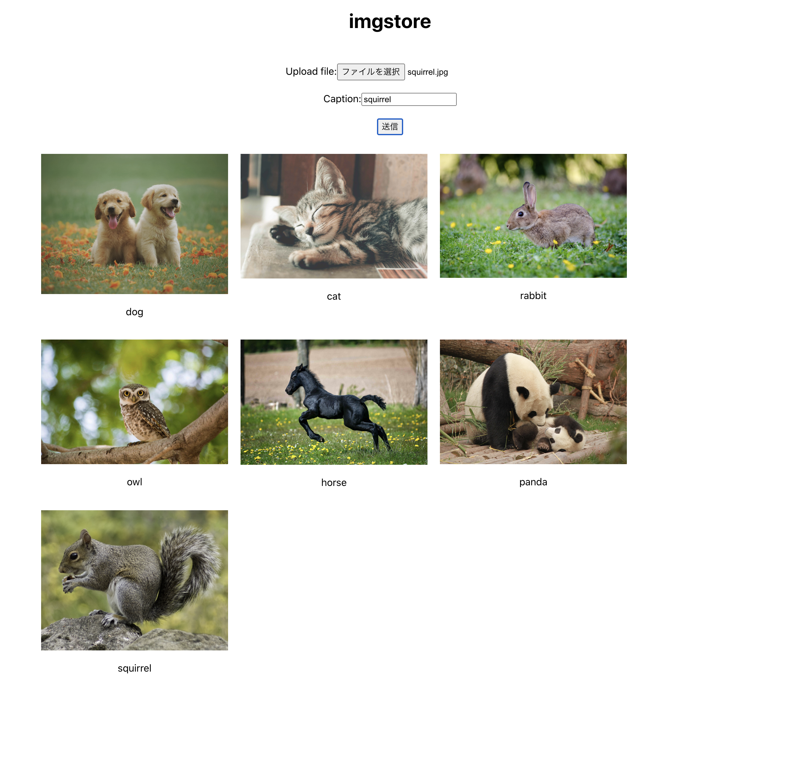

# imgstore
A sample application that stores images in an RDB.

## Deployment
1. Build the Docker image for the backend application.
```console
$ cd ./imgstore-backend && ./gradlew bootBuildImage
```

2. Build the Docker image for the frontend application.
```console
$ cd ./imgstore-frontend && docker build . -t imgstore-frontend
```

3. Apply kubernetes manifest files.
```console
$ kubectl apply -f k8s/mysql-manifest.yaml
$ kubectl apply -f k8s/backend-manifest.yaml
$ kubectl apply -f k8s/frontend-manifest.yaml
```

4. Access from your browser, `http://localhost`.

## Screenshot

